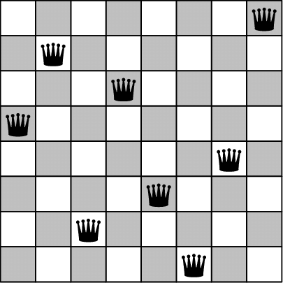

<!-- icons  -->
[1.1]: https://img.shields.io/badge/GitHub-100000?style=for-the-badge&logo=github&logoColor=white
[2.1]: https://img.shields.io/badge/LinkedIn-0077B5?style=for-the-badge&logo=linkedin&logoColor=white
[3.1]: https://img.shields.io/badge/Medium-12100E?style=for-the-badge&logo=medium&logoColor=white
[4.1]: https://img.shields.io/badge/Twitter-1DA1F2?style=for-the-badge&logo=twitter&logoColor=white

<!-- links to your social media accounts -->
[1]: https://github.com/produdez
[2]: https://www.linkedin.com/in/produdez/
[3]: https://medium.com/@produde
[4]: https://twitter.com/_Produde_

# AI Games (Searched based)

<p align="center">
    
</p>

**Description:**

Just some puzzles solved different searching algorithms, including:

- DFS
- BFS
- Greedy
- A*
- Iterative Deepening Search
- Uniform Cost Search
- Stochastic Hill Climb

Substitute the function in the code to change the search algorithm.

## General Information

Puzzles I've implemented include:

1. Eight Puzzle: Init puzzle with random moves added
2. N-Queen: Empty board of N*N
3. River Crossing: A pre-defined River crossing problem
4. Water Cups Problem: 2 different cup sizes settings

Extra:

1. Some CSP problems are included in `myCSP.py`
2. A basic NimGame is implemented using MiniMax and AlphaBeta Pruning in `myNimGame`


## Examples

1. 8-Puzzle Solved with `GreedySearch`  and `SimplePathHeuristics`
    - Init state with 100 random moves

        ```[text]
        Number of Random moves to make: ? 100
        Starting puzzle state:
        -------------
        | 3 | 1 | 8 |
        -------------
        | 5 | 6 | 4 |
        -------------
        | 2 | 7 |   |
        -------------
        Press enter to start searching!
        ```

    - Search Finished

        ```[text]
        done searching
        The function took: 2.03953s to finish
        greedySearch found a path of 26 moves: ['left', 'left', 'up', 'right', 'right', 'up', 'left', 'down', 'down', 'right', 'up', 'left', 'up', 'right', 'down', 'down', 'left', 'left', 'up', 'right', 'down', 'right', 'up', 'left', 'left', 'up']
        Press return to see solution states...
        ```

    - Final Result after 26 moves:

        ```[text]
        -----Move #26-----------------
        After 26 moves: up
        -------------
        |   | 1 | 2 |
        -------------
        | 3 | 4 | 5 |
        -------------
        | 6 | 7 | 8 |
        -------------
        Press return for the next state...
        ```

2. 10-Queen DFS
    - Search finish and first move

        ```[text]
        Press enter to start searching!
        done searching
        The function took: 41.14200s to finish
        depthFirstSearch found a path of 10 moves: [(0, 0), (1, 2), (2, 5), (3, 7), (4, 9), (5, 4), (6, 8), (7, 1), (8, 3), (9, 6)]
        Press return to see solution states...
        -----Move #1-----------------
        After 1 move: (0, 0)
        -----------------------------------------
        | Q | x | x | x | x | x | x | x | x | x |
        -----------------------------------------
        | x | x |   |   |   |   |   |   |   |   |
        -----------------------------------------
        | x |   | x |   |   |   |   |   |   |   |
        -----------------------------------------
        | x |   |   | x |   |   |   |   |   |   |
        -----------------------------------------
        | x |   |   |   | x |   |   |   |   |   |
        -----------------------------------------
        | x |   |   |   |   | x |   |   |   |   |
        -----------------------------------------
        | x |   |   |   |   |   | x |   |   |   |
        -----------------------------------------
        | x |   |   |   |   |   |   | x |   |   |
        -----------------------------------------
        | x |   |   |   |   |   |   |   | x |   |
        -----------------------------------------
        | x |   |   |   |   |   |   |   |   | x |
        -----------------------------------------
        ```

    - Final State:

        ```[text]
        -----Move #10-----------------
        After 10 moves: (9, 6)
        -----------------------------------------
        | Q | x | x | x | x | x | x | x | x | x |
        -----------------------------------------
        | x | x | Q | x | x | x | x | x | x | x |
        -----------------------------------------
        | x | x | x | x | x | Q | x | x | x | x |
        -----------------------------------------
        | x | x | x | x | x | x | x | Q | x | x |
        -----------------------------------------
        | x | x | x | x | x | x | x | x | x | Q |
        -----------------------------------------
        | x | x | x | x | Q | x | x | x | x | x |
        -----------------------------------------
        | x | x | x | x | x | x | x | x | Q | x |
        -----------------------------------------
        | x | Q | x | x | x | x | x | x | x | x |
        -----------------------------------------
        | x | x | x | Q | x | x | x | x | x | x |
        -----------------------------------------
        | x | x | x | x | x | x | Q | x | x | x |
        -----------------------------------------
        ```

3. NimGame splitting number `15`
   - Final Move: MAX player wins (aka player 1)

       ```[text]
           Move:  (8, 1)
           Last Stage
           Turn: -1 --[1, 2, 2, 1, 2, 1, 2, 1, 1, 2]
           Winner:  MAX
       ```
## Usage

1. Run `python <filename>.py`

2. Change code to play around with it!
   1. Search functions are in `modules/search.py`
   2. Puzzle interface is `modules/puzzle.py`

## Contact

Created by [@produdez](https://github.com/produdez) - feel free to contact me or follow my blog on medium ❤️!

<!-- [![alt text][1.1]][1] -->
[![alt text][2.1]][2]
[![alt text][3.1]][3]
[![alt text][4.1]][4]
